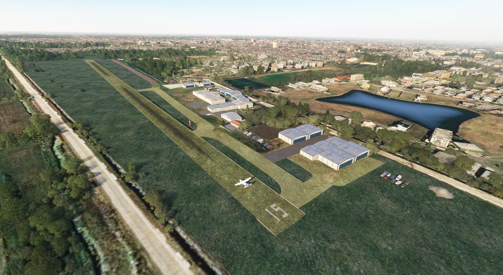
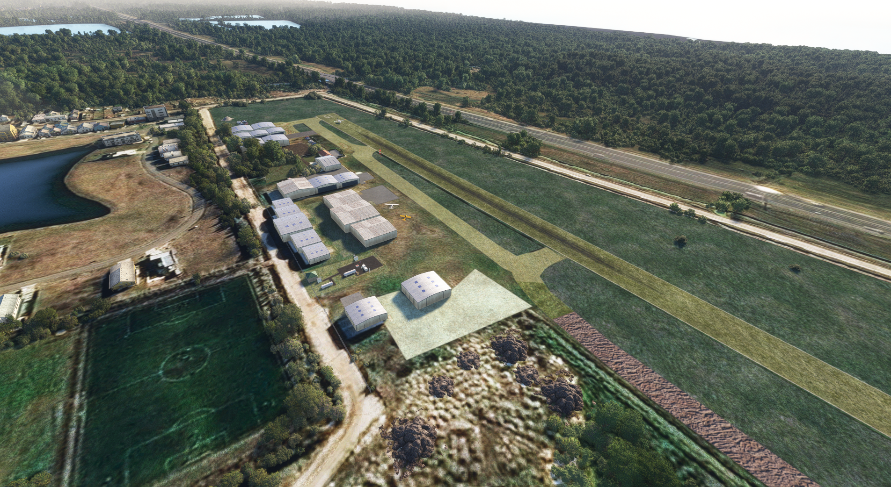
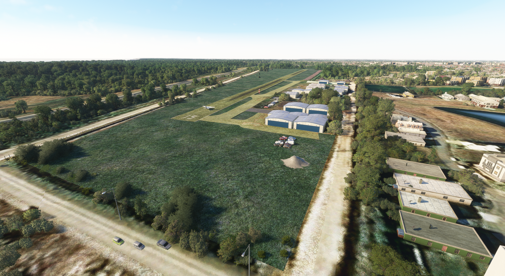
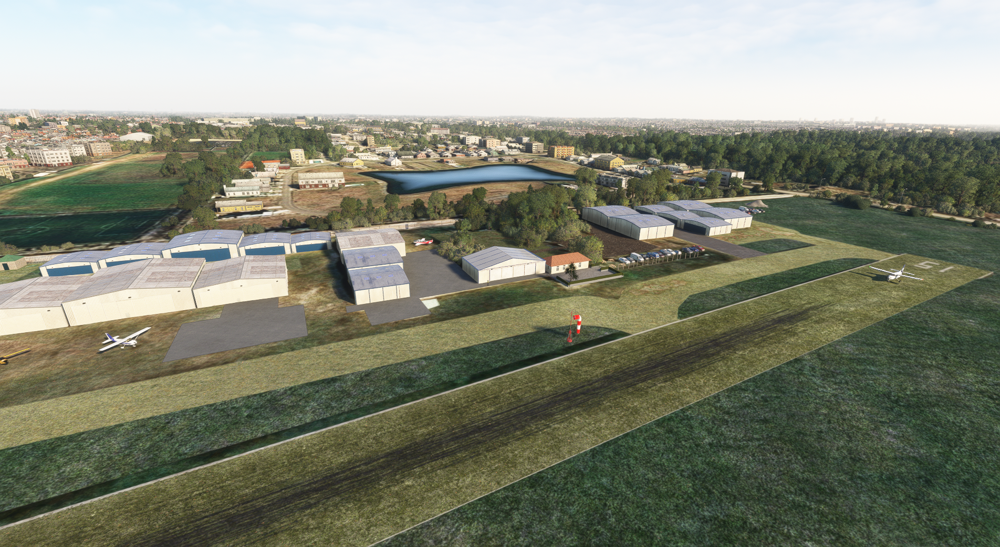
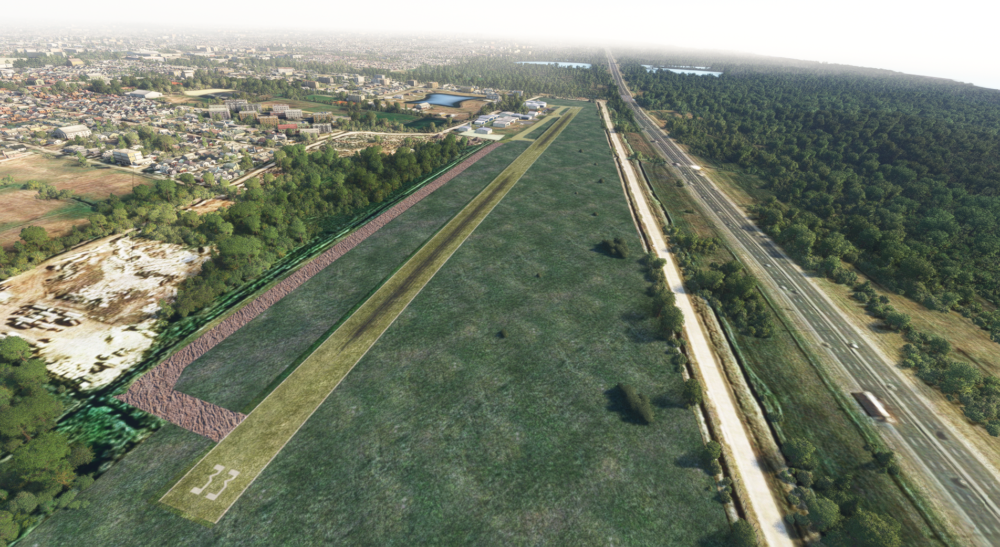

## Flight Simulator 2020 - Aeroclub Rio de la Plata - Argentina - Buenos Aires

Free to use airport.

**Author: Cronch - Agnalim**

**Always** give credit to the author if publishing information related to this mod on other places. Thank you!

**Real life location:** [Bings map](https://www.bing.com/maps?osid=a9a12c7f-25f0-4d94-af79-ad4791eb2d5a&cp=-34.745394~-58.205139&lvl=18&style=h&v=2&sV=2&form=S00027).

**Latest release download link:** [Release](https://github.com/user-attachments/files/15632031/saqu-ezp-agnalim-0.3.0.zip). 
**Brief video showing changes v0.1.0 compared to default:** [Video](https://www.youtube.com/watch?v=vgfBa01RB9M). 

### Installation:

1. Download zip file
2. Extract it
3. Move folder "agnalim-airport-saqu-ezpeleta" to your MSFS Community folder (just like any other scenary or addon)

More fixes and scenarios are coming!

If you know this airstrip, please share pictures and any other kind of information so we can keep improving it. Also you can create issues so we can keep track of things that need to be fixed

**If you like my work:** [Donate](https://bit.ly/3i6rT6g). 

You can also support my work with a cafecito here: 

### Pictures:

